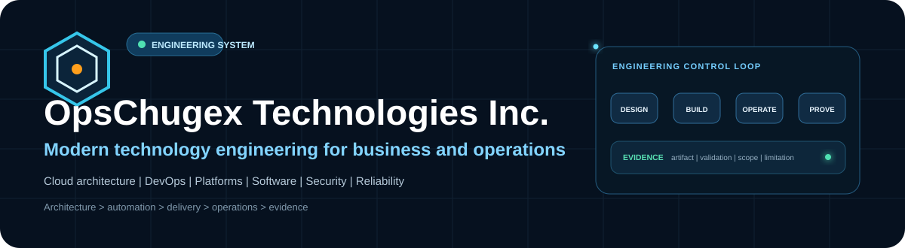
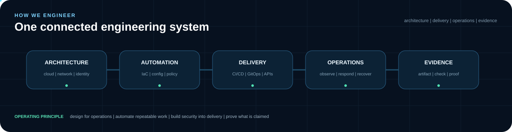
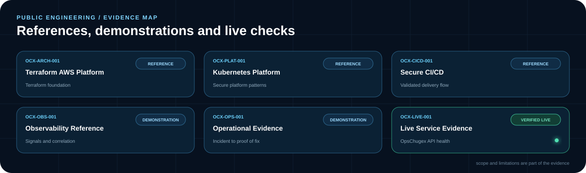



  

  
  
  

## Technology engineering

OpsChugex Technologies Inc. designs, builds, modernizes and operates technology systems across cloud infrastructure, DevOps, platform engineering, Kubernetes, software and APIs, security, observability and reliability.

Our engineering model connects **architecture, automation, delivery, operations and evidence**. Public repositories are intentionally labeled so a reference implementation, controlled demonstration and verified live-service check are not presented as the same thing.

## Public engineering evidence

### Architecture & platform references

- **[Terraform AWS Platform](https://github.com/OpsChugex/terraform-aws-platform)** ? `OCX-ARCH-001` ? Reference implementation. Terraform foundation covering networking, load balancing, container registry, Kubernetes, relational data, object storage and observability.
- **[Kubernetes Platform](https://github.com/OpsChugex/kubernetes-platform)** ? `OCX-PLAT-001` ? Reference implementation. Secure application namespace patterns covering workload controls, scaling, policy, disruption protection and health probes.
- **[Secure CI/CD Reference](https://github.com/OpsChugex/secure-cicd-reference)** ? `OCX-CICD-001` ? Documented reference. Delivery sequence across testing, security checks, build, deployment, smoke verification and monitoring.
- **[Observability Reference](https://github.com/OpsChugex/observability-reference)** ? `OCX-OBS-001` ? Demonstration design. Availability, latency, errors, deployments, restarts, logs and infrastructure-event signals.

### Operations & validation

- **[Operational Evidence Demo](https://github.com/OpsChugex/operational-evidence-demo)** ? `OCX-OPS-001` ? Controlled demonstration. Change, telemetry, diagnosis, human review, remediation and proof-of-fix workflow.
- **[Live Service Evidence](https://github.com/OpsChugex/live-service-evidence)** ? `OCX-LIVE-001` ? Verified live-service check. Public health validation for the OpsChugex-owned API, including API health, database connectivity and scheduler state.

> Public evidence is scoped carefully. Reference implementations do not claim deployed production outcomes; demonstrations do not claim customer monitoring; live checks are time-bound verification, not uptime guarantees.

## Engineering principles

<table><tr><td width="25%" valign="top"><b>Design for operations</b> Architecture includes reliability, recovery, observability and operating constraints from the start.</td><td width="25%" valign="top"><b>Automate repeatable work</b> Infrastructure, delivery and validation should be reproducible and reviewable.</td><td width="25%" valign="top"><b>Build security into delivery</b> Identity, secrets, policy and security checks belong inside the engineering path.</td><td width="25%" valign="top"><b>Prove what is claimed</b> Claims connect to artifacts, checks, evidence and explicit limitations.</td></tr></table>

## Technology ecosystem

AWS ? Azure ? Kubernetes ? Terraform ? Docker ? Jenkins ? GitHub Actions ? GitLab CI/CD ? Ansible ? Prometheus ? Grafana ? Python

## Work with OpsChugex

For engineering services, architecture discussions or technology partnerships:

**Website:** [opschugex.com](https://opschugex.com)

**Email:** [hello@opschugex.com](mailto:hello@opschugex.com)

**LinkedIn:** [OpsChugex Technologies Inc.](https://www.linkedin.com/company/opschugex)
